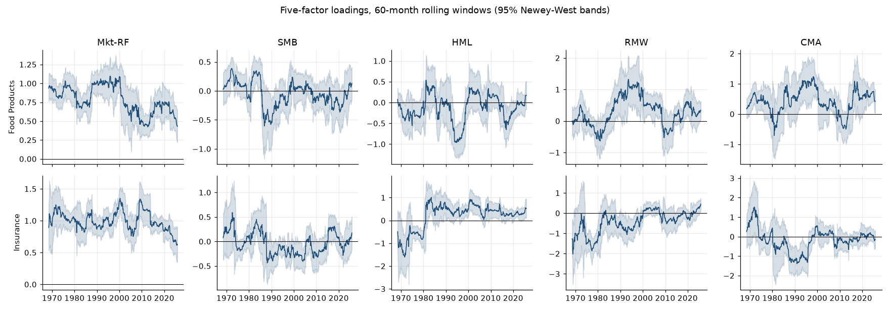

# Factor exposures and risk-adjusted performance: US Food Products and Insurance

Asset-pricing project, *Asset Valuation* (M1 ECAP). Notebook: [factor_models_food_insurance.ipynb](factor_models_food_insurance.ipynb).

**Brief.** A quantitative fund considers investing in two industry portfolios. Which risk factors are they exposed to? Which model best explains their returns? Are the exposures stable? Did either industry earn an abnormal return?

**Data.** Kenneth French's 49 industry portfolios (Food Products and Insurance) and the five Fama-French factors, 748 monthly observations, July 1963 to October 2025.

## Method

- **Models.** CAPM, Fama-French three factors (market, size, value) and five factors (adding profitability and investment). OLS and Newey-West standard errors coded directly from the matrix formulas, checked against `statsmodels` (identical to ten decimal places).
- **Stability.** 60-month rolling loadings with confidence bands; Chow test at September 2008 with p-values; a scan over all candidate break dates with a bootstrap critical value (the maximum of many F tests does not follow the F law); CUSUM.
- **Performance.** Annualised alphas, the Gibbons-Ross-Shanken joint test of the alphas, Sharpe ratios, behaviour in the 2008, 2020 and 2022 episodes.

## Results

| Industry | Model | Alpha (%/yr) | Market | SMB | HML | RMW | CMA | Adj. R² |
|---|---|---|---|---|---|---|---|---|
| Food | CAPM | 2.25 | 0.65*** | | | | | 0.451 |
| Food | FF3 | 1.46 | 0.70*** | -0.13** | 0.21*** | | | 0.475 |
| Food | FF5 | -1.42 | 0.77*** | 0.00 | -0.02 | 0.51*** | 0.45*** | 0.545 |
| Insurance | CAPM | 1.03 | 0.92*** | | | | | 0.552 |
| Insurance | FF3 | -0.79 | 1.00*** | -0.12 | 0.44*** | | | 0.607 |
| Insurance | FF5 | -1.51 | 1.01*** | -0.07 | 0.42*** | 0.17 | 0.04 | 0.610 |

1. Food is defensive (market beta 0.65 to 0.77) and behaves like profitable, low-investment firms. Its apparent value tilt in the three-factor model disappears in the five-factor model: HML and CMA are correlated, and the exposure was to investment and profitability.
2. Insurance has a market beta of one and a value tilt (HML 0.42). The five-factor model adds almost nothing for it (adjusted R² from 0.607 to 0.610); for Food it is a material gain.
3. No abnormal return. No alpha is significant, and the GRS test does not reject jointly zero alphas in any model (p = 0.28, 0.40, 0.45). The CAPM alphas shrink and change sign as factors are added: they compensated factor exposures.
4. Both industries have a structural break, at different dates. At September 2008 the Chow test rejects stability for Food (F = 7.59) but not for Insurance (F = 1.67, p = 0.13). Scanning all dates finds a larger break for Insurance in December 1979 (F = 18.4, bootstrap 5% critical value 3.95) and for Food in December 1998 (F = 10.3).
5. Full-sample loadings hide large swings. In 60-month windows the Insurance loading on profitability (RMW) averages -0.44 with a standard deviation of 0.53, against +0.17 over the full sample.
6. Risk. Annualised Sharpe ratios are 0.46 (Food) and 0.40 (Insurance). In December 2007 to June 2009 Insurance lost 3.5% a month on average, Food 0.8%: Food is the diversifier, Insurance the cyclical holding.

A factor loading is an exposure. A negative SMB loading means the portfolio behaves like large caps; it does not say that large firms earned more.



## Run

```bash
pip install pandas numpy scipy statsmodels matplotlib nbformat nbclient ipykernel
python ../macro_econometrie/src/build_nb.py nb_src/factor_models_food_insurance.py
```

## Limits

Two portfolios and standard factors only. GRS assumes normal residuals, which the data reject, so it is read alongside the Newey-West t-statistics. The bootstrap critical value for the break scan uses a six-month grid of dates; the detected breaks exceed it by a wide margin.
