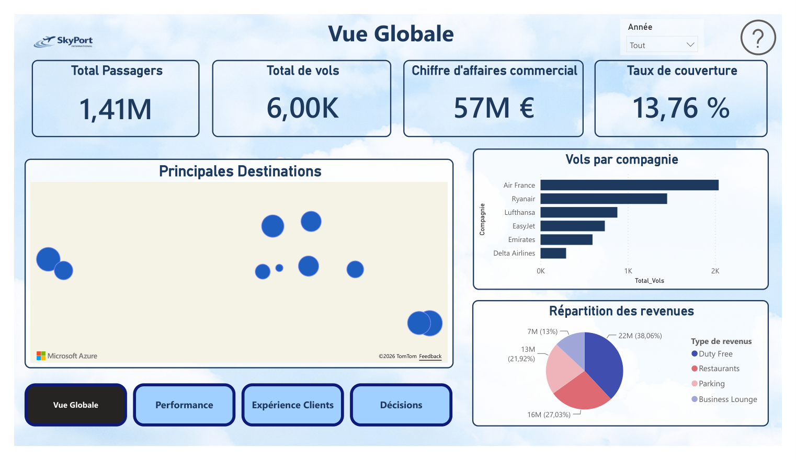
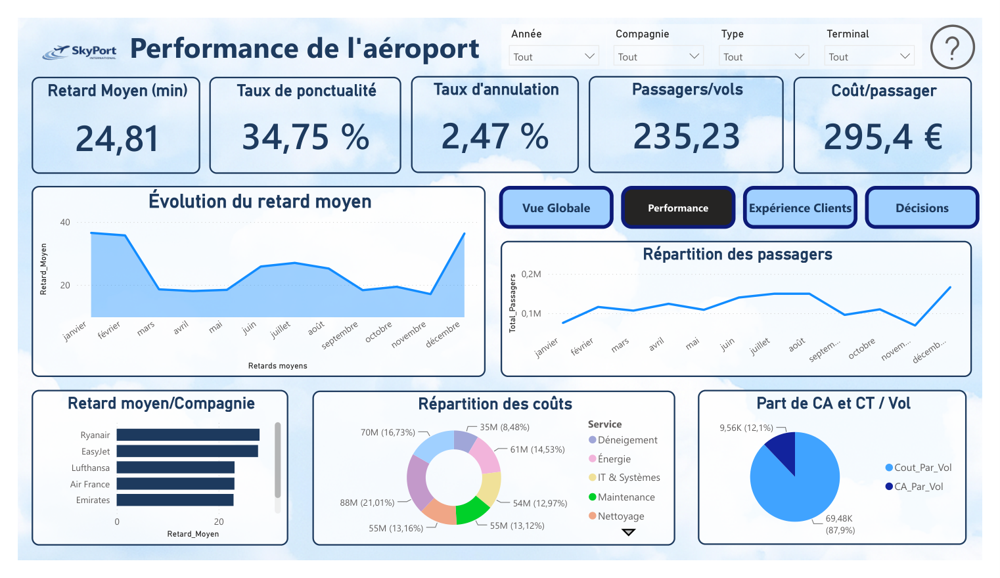
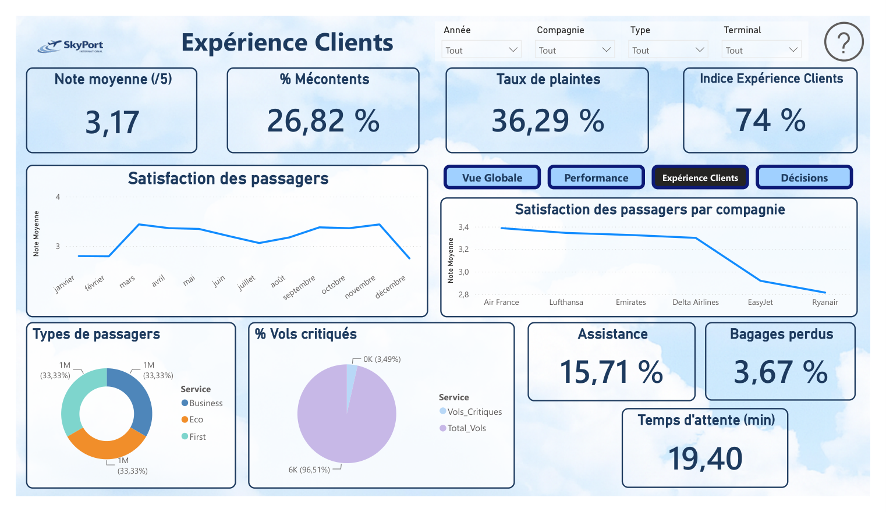
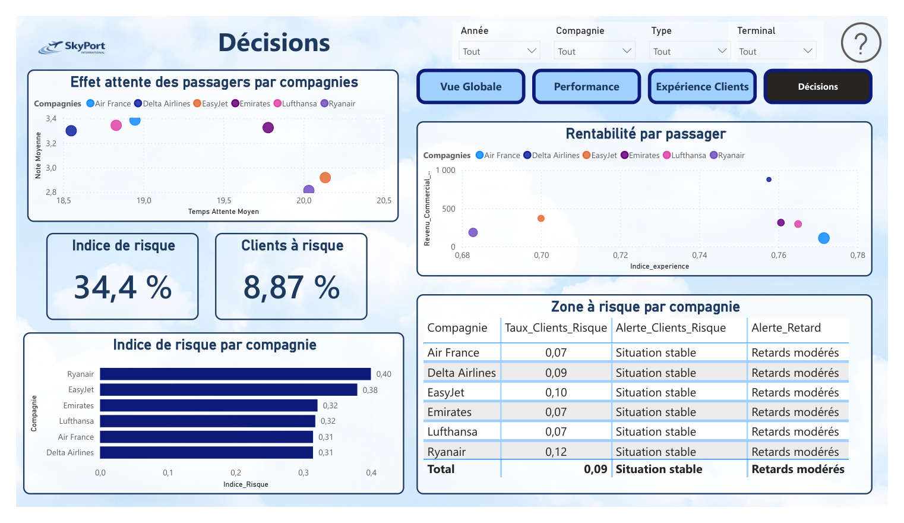

# SkyPort International: airport performance dashboard (Power BI)

Business-intelligence project, *Power BI* course (M1 ECAP), group project. Interactive five-page report built in Power BI Desktop: a home page with navigation and four analysis pages.

**Brief.** An airport operator wants to follow activity and commercial revenue, understand operational performance (delays, cancellations, costs), measure passenger experience, and identify which airlines and customers are at risk.

**Data.** The dataset is fictitious and was generated with AI: SkyPort is not a real airport. It contains operational and commercial tables on flights, passengers, revenues, costs, airlines and dates. The analysis pages have slicers for year, airline, flight type and terminal, and buttons to move between pages.

## Pages

### 1. Overview

Headline indicators (1.41 million passengers, about 6,000 flights, EUR 57 million of commercial revenue, a coverage ratio of 13.76%), a map of the main destinations, flights per airline (Air France first, then Ryanair and Lufthansa) and the breakdown of commercial revenue by source: duty free 38%, restaurants 27%, parking 22%, business lounges 13%.

### 2. Airport performance

Average delay (24.8 minutes), punctuality rate (34.75%), cancellation rate (2.47%), passengers per flight (235) and cost per passenger (EUR 295). The monthly view shows delays peaking in winter (around 36 to 37 minutes in January, February and December) and falling to 17 to 19 minutes in spring and autumn; the airline view and the cost breakdown by service (snow clearing, energy, IT, maintenance, cleaning) show where the operating cost sits.

### 3. Customer experience

Average rating 3.17 out of 5, 26.8% of unhappy passengers, a complaint rate of 36.3% and an experience index of 74%. Satisfaction ranks by airline from Air France (about 3.4) to Ryanair (about 2.8), and the page also tracks waiting time (19.4 minutes), assistance requests (15.7%), lost baggage (3.7%) and the share of critical flights.

### 4. Decisions

This page links the three previous ones for decision-making: the effect of waiting time on ratings by airline, revenue per passenger against the experience index, a composite risk index (34.4% for the whole airport, 8.9% of customers at risk) and a risk table with alerts per airline. Ryanair has the highest risk index (0.40), followed by EasyJet (0.38).

## What it demonstrates

- Calculated indicators: ratios, shares, composite experience and risk indices.
- Dashboard design for a decision-maker: one question per page, consistent filters, navigation, thresholds and alerts.
- A risk index that ranks airlines for follow-up.

## Files

The five pages are exported in `figures/`. The Power BI file (`.pbix`) is available on request.
