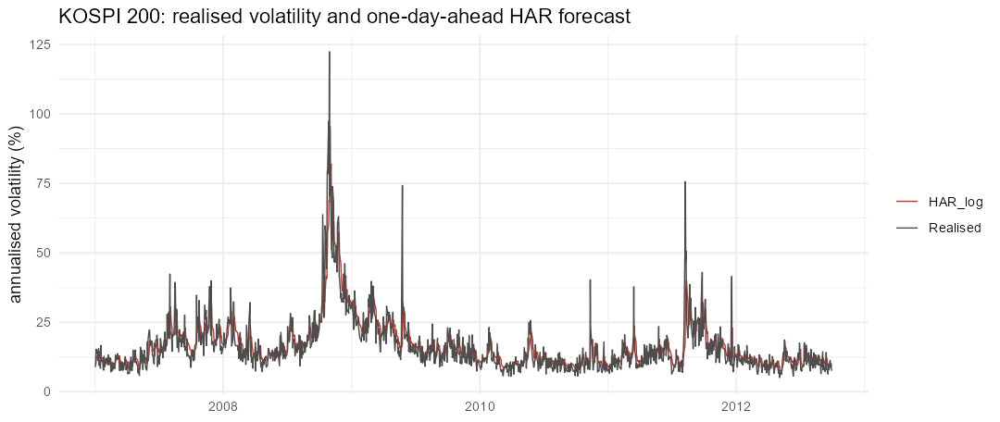

# Evaluating market forecasts: returns and volatility (R)

Two forecasting problems on market data, each tested against simple benchmarks. Course project, *Univariate Time Series* (M1 ECAP).

1. Daily returns of wheat futures, five days ahead. Can an autoregression predict the direction or size of returns?
2. KOSPI 200 realised volatility, one day ahead. Which HAR specification forecasts best?

## Method

- **Returns.** Rolling windows of three and five years, re-estimated at every date. Models: zero forecast, historical mean, persistence (return stays at its last value), AR(1) on each window. Evaluation by RMSE and MAE, Diebold-Mariano tests with a HAC variance, Mincer-Zarnowitz regressions with a joint Wald test (α = 0, β = 1) and HAC errors, and the Sharpe ratio of a long/short strategy that follows the sign of the forecast.
- **Volatility.** Expanding window from January 2007. Heterogeneous autoregressive (HAR) models with daily, weekly and monthly components, estimated in levels and in logs (with the lognormal correction when mapping back to levels), plus a jump-robust variant using MedRV regressors. Every model forecasts the same target, realised variance, so losses are comparable. Loss: QLIKE; Diebold-Mariano tests.

## Results

Wheat futures returns, 5 days ahead (3,153 forecasts, 2010-2022). DM against the zero forecast; negative means worse than zero.

| Model | RMSE (bp) | MAE (bp) | DM (MSE) | DM (MAE) | Annualised Sharpe of a sign strategy |
|---|---|---|---|---|---|
| Zero | 191.9 | 140.7 | benchmark | benchmark | no position |
| Historical mean (5y) | 192.0 | 140.8 | -1.23 | -2.66*** | -0.35 |
| Persistence | 269.8 | 201.3 | -14.62*** | -21.19*** | 0.11 |
| AR(1), 5-year window | 192.0 | 140.8 | -1.29 | -2.72*** | -0.39 |
| AR(1), 3-year window | 192.1 | 140.9 | -1.33 | -3.37*** | -0.05 |

Daily futures returns are not predictable here. No model beats the zero forecast, and the AR models are significantly worse in absolute error. The sign strategies have Sharpe ratios between -0.39 and 0.11, against 0.01 for buy-and-hold over the same days.

KOSPI 200 realised variance, 1 day ahead (1,433 forecasts, 2007-2012). DM against the log-HAR; negative means worse.

| Model | QLIKE | RMSE (×10⁻⁴) | DM vs log-HAR |
|---|---|---|---|
| Random walk (yesterday's RV) | 0.1737 | 2.197 | -3.56*** |
| HAR in levels | 0.1524 | 2.039 | -2.26** |
| HAR in logs | 0.1425 | 1.961 | benchmark |
| HAR in logs, MedRV regressors | 0.1681 | 2.308 | -5.66*** |

Volatility, unlike returns, is persistent and forecastable: the log-HAR significantly beats the random walk and the HAR in levels. Jump-robust MedRV regressors do not improve forecasts of RV.



## Run

```r
install.packages(c("readxl", "dplyr", "tidyr", "ggplot2", "sandwich", "lmtest", "car", "zoo"))
```

```bash
Rscript forecast_evaluation.R
```

## Limits

Sign strategies ignore transaction costs. The Mincer-Zarnowitz test has little power because the AR forecasts barely vary. The KOSPI sample ends in 2012 and contains the 2008 crisis, which weighs heavily in squared-error rankings; QLIKE is less sensitive to it.
