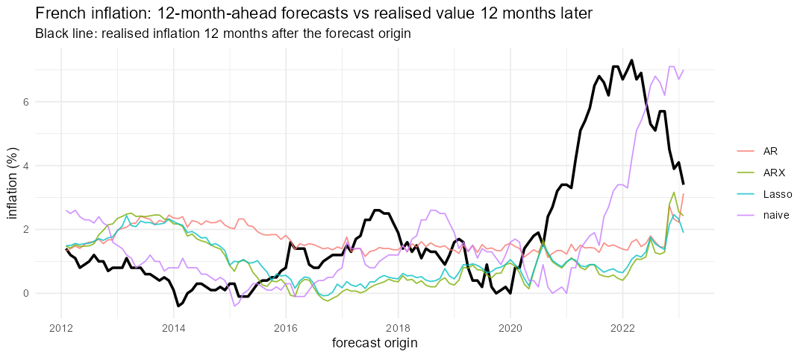

# Forecasting French inflation (R)

Forecasting monthly French inflation with oil prices, an energy price index, the USD/EUR rate and the 10-year yield, and testing whether these predictors help out of sample. Course project, *Forecasting and Business-Cycle Techniques* (M1 ECAP).

**Question.** Do macro-financial predictors improve inflation forecasts at 1, 3, 6 and 12 months, compared with an autoregression?

**Data.** Monthly, January 2004 to January 2024 (241 observations): inflation, an energy price index, 10-year yield, oil price, USD/EUR.

**Method.**
- Direct h-step forecasts (h = 1, 3, 6, 12) from predictors observed at the forecast origin: inflation and its lag, 3-month changes of oil, energy prices, USD/EUR and the 10-year yield, and the yield level.
- Expanding window, one forecast per month from January 2012 (133 to 144 forecasts per horizon).
- Models: naive (inflation stays where it is), AR, AR with the predictors (ARX), lasso with cross-validation, and an equal-weight combination.
- Evaluation: RMSE relative to the AR, Diebold-Mariano tests with the Harvey-Leybourne-Newbold correction, full sample and two sub-periods by forecast origin (2012-2019, and 2021 onward for the energy shock).
- A reference model, `ARX_oracle`, uses the *realised* predictor values at the target date. It is not a feasible forecast: it shows how much a conditional forecast, with future predictors known, would look better than a true forecast.

## Results (RMSE ratio to the AR, below 1 is better)

| Period | h | AR RMSE (pp) | naive | ARX | Lasso | Combo | ARX with known future predictors |
|---|---|---|---|---|---|---|---|
| 2012-2024 | 3 | 0.70 | 0.95* | 1.03 | 1.03 | 1.00 | 0.73*** |
| 2012-2024 | 12 | 2.19 | 0.77 | 1.11 | 1.07 | 1.04 | 0.84** |
| 2012-2019 | 6 | 0.74 | 0.83* | 0.91 | 0.91 | 0.86** | 0.82** |
| 2021 onward | 12 | 4.30 | 0.74 | 1.13 | 1.11 | 1.08 | 0.84** |

Full table: [`results_table.csv`](results_table.csv).

1. The predictors do not beat an AR when only past information is used. Ratios are 1.00 to 1.13 in almost every cell. The exceptions are in 2012-2019 (0.91 at 6 months for both models, 0.95 at 12 months for the lasso) and are not significant.
2. If the future values of the predictors were known, the same model would gain 6 to 29%. The conditional gain is large; the information it relies on is not available to a forecaster.
3. At 6 to 12 months "inflation stays where it is" beats the AR (ratios 0.70 to 0.86), plausibly because the AR shrinks toward the sample mean and misses persistent regime changes. Only one of these differences is significant at 10% (2012-2019 at 6 months), so they are suggestive.



## Run

```r
install.packages(c("readr", "dplyr", "ggplot2", "forecast", "glmnet", "tidyr"))
```

```bash
Rscript inflation_france_oos.R
```

Outputs: `forecasts.csv`, `results_table.csv`, `forecasts_h12.png`.

## Limits

Final-vintage data. Predictors are lagged by construction, the realistic but harder setting; forecasts of oil or the exchange rate from outside the model are the natural extension. Outlier correction (tsoutliers) and Gets variable selection are not included here.
