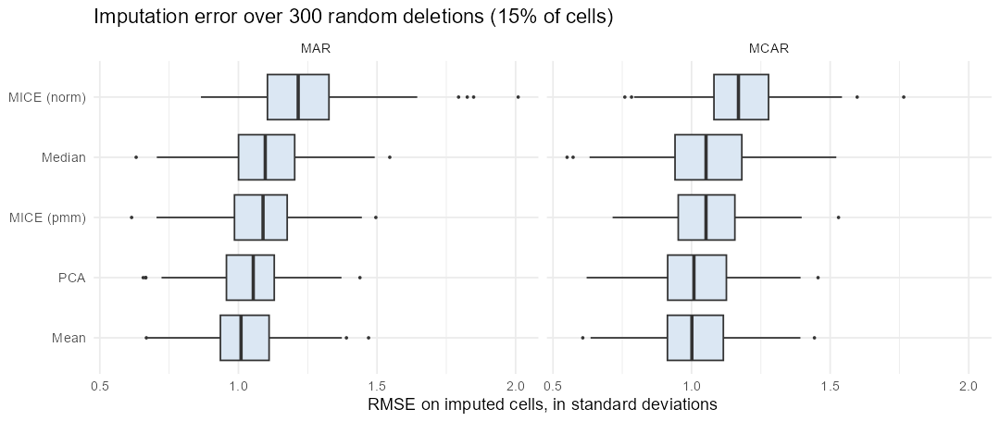

# Imputing missing data on a small financial cross-section (R)

Course project, *Biostatistics* (M1 ECAP, group project), extended here into a simulation study.

**Question.** Companies' financial data are often incomplete. On the 40 firms of the CAC 40, which imputation method recovers the missing values best, and is multiple imputation worth it?

**Data.** The 40 CAC 40 firms with seven quantitative variables: return, revenue, trading volume, P/E, beta, ESG score and debt.

## Method

- Delete 15% of the cells at random, impute them, and measure the error against the true values.
- Repeat 300 times under two mechanisms: completely at random (MCAR), and at random given an observed variable (MAR: large firms by revenue are more often missing).
- Methods: mean, median, PCA imputation (two components), MICE with predictive mean matching, and MICE with a normal model.
- Error measured on the imputed cells only, in standard deviations of each variable (1.0 is no better than guessing the mean).
- Multiple imputation used for inference: a regression of returns on ESG score and beta, with estimates pooled over 20 imputations with Rubin's rules, compared with listwise deletion and with the complete data.

## Results

| Method | MCAR: mean error | MCAR: best in | MAR: mean error | MAR: best in |
|---|---|---|---|---|
| Mean | 1.01 | 33% of draws | 1.02 | 50% |
| PCA (2 components) | 1.02 | 33% | 1.05 | 28% |
| MICE, predictive mean matching | 1.05 | 19% | 1.08 | 17% |
| Median | 1.06 | 11% | 1.10 | 3% |
| MICE, normal model | 1.17 | 4% | 1.23 | 3% |

1. No method beats the mean. Every error is about one standard deviation: with 40 firms and weakly correlated variables, the other variables carry almost no information about a missing cell.
2. PCA beats MICE in about two draws out of three (64% under MCAR, 67% under MAR). A single deletion therefore gives the opposite ranking one time in three, which is why the experiment is repeated.
3. Dispersion across draws is large: for mean imputation under MCAR the error ranges from 0.75 to 1.26 (5th to 95th percentile), and the other methods have similar spreads.



Multiple imputation is about inference, not guessing cells. Regression of returns on ESG and beta, one draw:

| | ESG coefficient (s.e.) | Beta coefficient (s.e.) | Firms used |
|---|---|---|---|
| Complete data | 1.79 (0.88) | 28.0 (15.8) | 40 |
| Listwise deletion | 1.41 (1.25) | 42.8 (23.6) | 22 |
| MICE, 20 imputations, pooled | 1.45 (0.91) | 38.9 (18.1) | 40 |

Listwise deletion loses 18 of 40 firms and inflates the standard errors by 40 to 50%. Pooling keeps all firms and brings the standard errors back close to the complete-data ones.

## Run

```r
install.packages(c("readr", "dplyr", "tidyr", "ggplot2", "mice", "missMDA"))
```

```bash
Rscript imputation_simulation.R
```

About 20 minutes. All draws are saved in `output/simulation_draws.csv`.

## Limits

One dataset of 40 rows: "nothing beats the mean" describes this setting, not imputation in general. The number of PCA components is fixed at two. The pooling example is a single draw; a coverage study over many draws is the natural extension.
