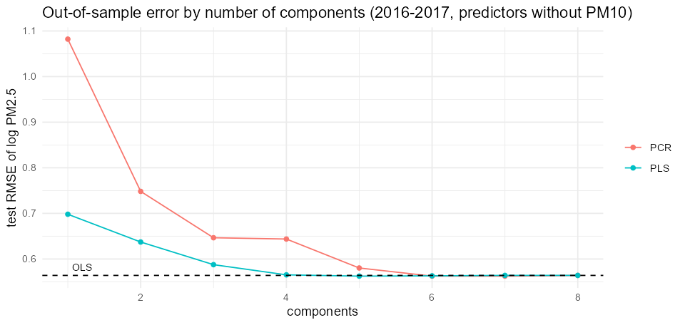

# Predicting PM2.5 in Beijing: PCR, PLS and OLS (R)

Course project, *Latent-Variable Modelling* (M1 ECAP, group project), extended here with a time-aware validation.

**Question.** Air-quality variables are strongly correlated. Do latent-variable regressions (principal-component regression, partial least squares) predict fine-particle concentrations better than ordinary least squares?

**Data.** Hourly measurements at the Aotizhongxin station, Beijing, March 2013 to February 2017 (31,692 complete observations): PM2.5, PM10, SO₂, NO₂, CO, O₃, temperature, pressure, dew point and wind speed. Pollutants in logs.

## Method

- Target: log PM2.5. Predictors with and without PM10 (PM2.5 is part of PM10).
- Chronological split: training 2013-2015, test 2016-2017. A random split of hours is run alongside to measure how much it flatters the models.
- Number of components chosen by blocked 10-fold cross-validation (consecutive segments) and the one-sigma rule, on the training period only.
- Benchmarks: OLS, and a persistence forecast (the previous hour's value).
- Variance inflation factors, test error by number of components.

## Results (test set, log PM2.5)

| Predictors | Model | Components | RMSE, chronological | R² | RMSE, random split |
|---|---|---|---|---|---|
| Without PM10 | OLS | 8 | 0.564 | 0.758 | 0.538 |
| Without PM10 | PCR | 5 | 0.580 | 0.744 | 0.539 |
| Without PM10 | PLS | 4 | 0.565 | 0.757 | 0.539 |
| With PM10 | OLS | 9 | 0.382 | 0.889 | 0.367 |
| With PM10 | PCR | 9 | 0.382 | 0.889 | 0.367 |
| With PM10 | PLS | 5 | 0.379 | 0.891 | 0.368 |
| Any | Persistence (previous hour) | | 0.360 | 0.902 | 0.325 |

1. PLS matches OLS with half the components. The three methods are within 3% of each other; the benefit of PLS here is parsimony, not accuracy. PCR needs more components for the same error.
2. Multicollinearity is moderate. The highest variance inflation factors are for temperature (8.2) and dew point (7.3), not for the pollutants.
3. PM10 does most of the work. Adding it lifts R² from 0.76 to 0.89.
4. A random split of hours flatters every model by 3 to 7% in RMSE, because neighbouring hours are nearly identical.
5. Nothing beats "same as the previous hour" (R² 0.90). Explaining PM2.5 from pollutants measured in the same hour is description; forecasting needs lagged values.



## Run

```r
install.packages(c("readr", "dplyr", "tidyr", "ggplot2", "pls"))
```

```bash
Rscript pcr_pls_air_quality.R
```

## Limits

One station. Hours with missing values are dropped (about 10%); imputation is an extension. Variable-importance (VIP) analysis and the two-response PLS2 of the group report are not reproduced here.
