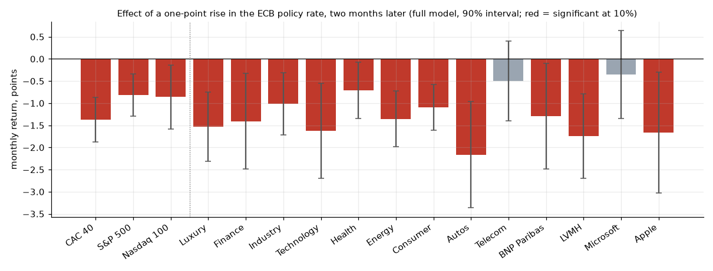
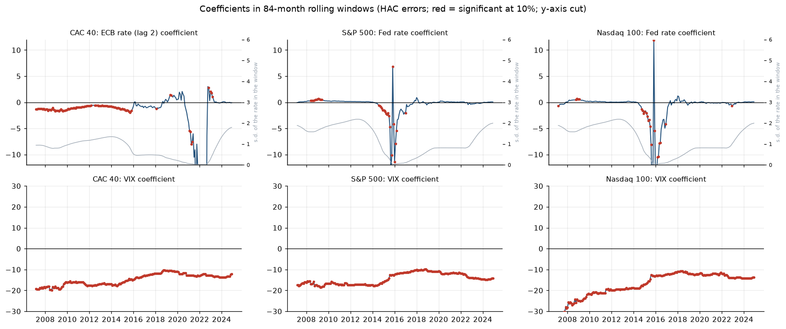
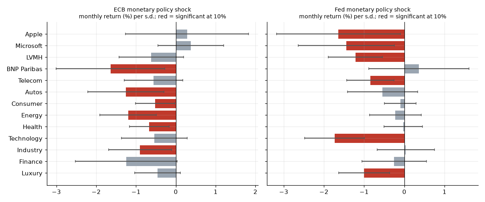

# ECB and Fed monetary policy and financial returns

Master 1 thesis, Econometrics and Statistics (applied econometrics track), IAE Nantes, 2025-2026. Supervisor: J. Duc. Synthesis note in French: [Word version](NOTE_DE_SYNTHESE.docx) and [extended text version](NOTE_DE_SYNTHESE.md).

**Question.** To what extent do ECB and Fed decisions drive the returns of French and US equity markets, and does the effect depend on the index, the sector, the period and the monetary regime?

**Data.** 297 monthly observations, April 2000 to December 2024 (FRED, Yahoo Finance, ECB). Returns of the CAC 40, S&P 500 and Nasdaq 100 (price indices), of nine CAC 40 sectors (equal-weighted averages of their firms' returns) and of four stocks (LVMH, BNP Paribas, Microsoft, Apple), the last two groups from dividend-adjusted prices. Policy rates (ECB main refinancing rate, Fed funds target), 10-year yields, regime and QE dummies. Controls: inflation, unemployment, the USD/EUR rate (dollars per euro), VIX and oil. High-frequency monetary policy shocks (Jarociński and Karadi 2020) for an extension.

**Method.** Five nested OLS specifications per index with robust (HC3) standard errors; 84-month rolling windows (HAC errors); the same model for sectors and stocks; regressions on announcement surprises split into a monetary policy shock and a central-bank information shock; diagnostics tested at the 10% level.

## Main results

1. The ECB policy rate weighs on all three indices. In the full model (excess returns), a one-point rise two months earlier lowers the monthly return by 1.4 points for the CAC 40, 0.8 for the S&P 500 and 0.9 for the Nasdaq 100 (significant at 10% for the latter): the discount-rate channel. The Fed rate in level has no negative effect: its coefficient is positive for the CAC 40 and the S&P 500 and not significant for the Nasdaq 100. The two policy rates are correlated at 0.72 and are read together.



| Full model | ECB rate (lag 2) | Fed rate | OAT 10y | Treasury 10y | VIX | USD/EUR |
|---|---|---|---|---|---|---|
| CAC 40 | -0.014 *** | +0.007 *** | -0.076 *** | +0.088 *** | -0.14 *** | +0.23 ** |
| S&P 500 | -0.008 *** | +0.006 *** | -0.048 ** | +0.049 *** | -0.14 *** | +0.40 *** |
| Nasdaq 100 | -0.009 * | n.s. | -0.083 *** | +0.080 *** | -0.17 *** | +0.56 *** |

2. Long rates work in opposite directions. Holding other variables fixed, rising French yields lower the CAC 40 (-1.3 points per standard deviation of the monthly change in the OAT yield) and rising US yields raise it (+1.9 points). The coefficients are nearly mirror images and the two yield changes are correlated at 0.74: returns respond to the gap between them.

3. Volatility is the most stable driver, and a weaker dollar goes with higher returns. In the full models a 1% rise in the VIX lowers the monthly return by 0.14 to 0.17 point, and the coefficient is negative and significant at 1% in every specification that includes it. A 1% rise in the USD/EUR rate (more dollars per euro, a depreciation of the dollar) is associated with +0.23 point for the CAC 40, +0.40 for the S&P 500 and +0.56 for the Nasdaq 100.

4. The estimated effect of policy rates changes over time, and it can only be estimated when the rate moves.



ECB rate and CAC 40, 84-month windows:

| Windows ending | Coefficient (points) | Significant at 10% | Rate inside the window |
|---|---|---|---|
| 2007 to 2015 | -1.2 (median) | 95%, all negative | moves (s.d. about 1 point) |
| January 2016 to November 2020 | -0.6 (median) | 5% | moves less and less |
| December 2020 to August 2022 | -3 to -46 | 62%, all negative | takes 2 to 4 values, between 0 and 0.25% |
| September 2022 to December 2024 | +1 to +3 until March 2023, then near 0 | 14%, all positive | moves again |

The large negative coefficients of 2021-2022 come from windows in which the rate barely moves, so they do not measure a higher sensitivity. The Fed coefficient is significant in at most 28% of windows. Its large negative values, in windows ending from late 2014 to early 2017, have the same cause: the rate stayed at 0.125% from 2009 to 2015. Only the VIX is significant in every window.

5. Sectors and stocks. The ECB rate is significantly negative for 11 of 13 series (not telecoms or Microsoft), strongest for autos. Finance, autos, technology, telecoms and BNP Paribas have the largest coefficients on both long rates (Apple has the largest on the OAT alone). The Fed policy rate has a negative coefficient for none of the French series: the US influence on French stocks shows up in US long rates, the dollar and the VIX.

6. What moves markets is the surprise (extension). Monthly return (%) per one-standard-deviation shock:

| Index | ECB policy | ECB information | Fed policy | Fed information |
|---|---|---|---|---|
| CAC 40 | -0.69 ** | +1.09 *** | -0.53 ** | +0.60 ** |
| S&P 500 | -0.40 | +0.61 ** | -0.83 *** | +0.50 * |
| Nasdaq 100 | -0.22 | +0.76 ** | -1.53 *** | +0.55 |

Each market reacts first to its own central bank. Spillovers are asymmetric: the Fed shock moves the CAC 40, the ECB shock does not significantly move US indices. The Nasdaq 100 reacts almost twice as much as the S&P 500 to a Fed shock.



## Limits of OLS in this project

Tested at the 10% level on the full models, residuals are not normal for any index, variance is not constant, ARCH effects are present everywhere, serial correlation remains for the CAC 40 and the functional form is rejected for the Nasdaq 100. Multicollinearity is low (largest VIF 4.2) and no observation is influential. For the three regressors kept in level (the two policy rates and the US unemployment rate), ADF rejects a unit root and KPSS rejects stationarity: these persistent series weaken inference.

Heteroskedasticity, serial correlation and non-normal errors leave OLS coefficients consistent but make classical standard errors unreliable, so all results use robust errors. The main result survives: the ECB rate is significant at 5% for the CAC 40 and S&P 500 under HC3 and HAC errors, and at about 5% for the Nasdaq 100 (p = 0.05 with HC3, 0.03 with HAC). For the Nasdaq 100 the RESET rejection means the linear form is an approximation.

OLS measures conditional correlations, not causal effects: the policy rate reacts to the economy and to markets, and the VIX and the change in long yields, observed in the same month, react to the same news. Average coefficients over 25 years hide different regimes, and monthly data dilute the reaction to an announcement.

## Files

- `01_baseline_regressions.py`: five nested models for the indices, sectors and stocks, and the figure of the ECB rate effect.
- `02_rolling_and_shocks.py`: rolling windows, shock regressions, sectors and stocks.
- `03_diagnostics.py`: tests at the 10% level, unit-root tests on the regressors kept in level, and comparison of classical, HC3 and HAC standard errors.
- `dashboard.py`: interactive Dash application on the results (`python dashboard.py`, needs `dash` and `dash-bootstrap-components`).
- `build_adjusted_returns.py`: stock and sector returns from adjusted prices. `data/data_monthly.csv` is the dataset the scripts use.
- `data/`: monthly dataset and shock series; `sorties/`: all tables.

```bash
pip install pandas numpy statsmodels matplotlib scipy yfinance dash dash-bootstrap-components
python 01_baseline_regressions.py
python 02_rolling_and_shocks.py
python 03_diagnostics.py
```
